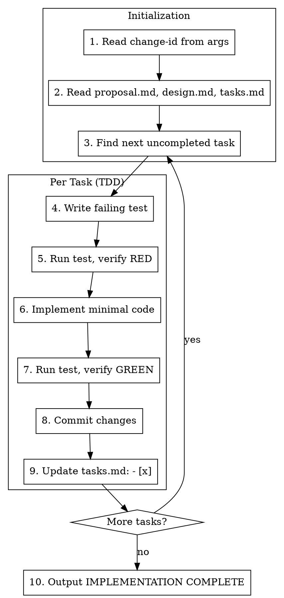

# Apply Phase

Execute implementation with TDD methodology. Supports Ralph Loop for unattended execution.

**Arguments:** `$ARGUMENTS` (change-id)

## Process



## Self-Check Mechanism (Ralph Loop Support)

**CRITICAL:** At the start of EVERY iteration, perform this check:

```
1. Read openspec/changes/<change-id>/tasks.md
2. Parse all `- [ ]` items (uncompleted)
3. Parse all `- [x]` items (completed)
4. If NO uncompleted items exist:
   -> Output: <promise>IMPLEMENTATION COMPLETE</promise>
   -> STOP
5. If uncompleted items exist:
   -> Take the FIRST uncompleted item
   -> Execute it following TDD
   -> Update tasks.md
   -> Continue
```

This mechanism allows Ralph Loop to:
- Re-enter with same prompt
- See previous work in tasks.md
- Continue from where it left off
- Stop automatically when done

## Step 1: Get Change ID

The change-id should be provided as argument:
```
/agentic-dev:apply add-shortcuts
```

If not provided, check for active changes:
```bash
openspec list
```

## Step 2: Read Proposal Files

Read these files to understand context:
```
openspec/changes/<change-id>/
├── proposal.md   # Why and what
├── design.md     # Technical decisions (if exists)
└── tasks.md      # Implementation checklist
```

## Step 3: Find Next Task

Parse `tasks.md` and find first `- [ ]` item.

Example tasks.md:
```markdown
## 1. Implementation

### Task 1.1: Create shortcut service
- [x] 1.1.1 Write failing test
- [x] 1.1.2 Run test, verify failure
- [ ] 1.1.3 Implement minimal code    <-- NEXT
- [ ] 1.1.4 Run test, verify pass
- [ ] 1.1.5 Commit
```

## Steps 4-8: TDD Execution

### 4. Write Failing Test

```typescript
// Example: tests/shortcuts/shortcut-service.test.ts
describe('ShortcutService', () => {
  it('should register global shortcut', () => {
    const service = new ShortcutService();
    service.register('Ctrl+Space', callback);
    expect(service.isRegistered('Ctrl+Space')).toBe(true);
  });
});
```

### 5. Run Test, Verify RED

```bash
npm test -- --grep "ShortcutService"
# Expected: FAIL - ShortcutService is not defined
```

### 6. Implement Minimal Code

Write only enough code to make the test pass. No extra features.

### 7. Run Test, Verify GREEN

```bash
npm test -- --grep "ShortcutService"
# Expected: PASS
```

### 8. Commit Changes

```bash
git add -A
git commit -m "feat(shortcuts): add ShortcutService with register method"
```

## Step 9: Update tasks.md

**IMMEDIATELY** after completing each step, update tasks.md:

```markdown
- [x] 1.1.3 Implement minimal code    <-- Changed from [ ] to [x]
```

This is critical for Ralph Loop to track progress.

## Step 10: Update Documentation

Update project documentation to reflect implementation progress:

### README.md
- Update "Active Changes" table: change status from "Proposed" to "Implementing" or "Implemented"
- Add any new commands, tools, or features to relevant sections
- Update architecture diagram if new components added

### CLAUDE.md
- Add any new slash commands or workflows
- Update development instructions if process changed
- Document any new integration patterns

## Step 11: Complete

When ALL tasks are marked `- [x]` and docs are updated:

```
<promise>IMPLEMENTATION COMPLETE</promise>
```

## Task Completion Output

After each task step, output progress:

```
<promise>TASK 1.1.3 COMPLETE</promise>
```

This helps track granular progress in Ralph Loop.

## Red Flags

- Skipping tests (violates TDD)
- Implementing before test fails
- Forgetting to update tasks.md (breaks Ralph Loop)
- Implementing extra features not in spec
- Not committing after each task

## Error Handling

If a step fails:
1. **Don't skip it** - fix the issue
2. **Don't proceed** - task must pass before moving on
3. **Document** - note the error in commit message if it required debugging

If blocked:
1. Output current progress
2. Explain the blocker
3. Ask for help (in manual mode) or retry (in Ralph Loop)

## Subagent Mode (Optional)

For complex tasks, can dispatch subagents per task:

```
Use superpowers:subagent-driven-development for:
- Large tasks spanning multiple files
- Tasks requiring spec review
- Tasks needing code quality review
```

In simple cases, execute directly without subagents.
