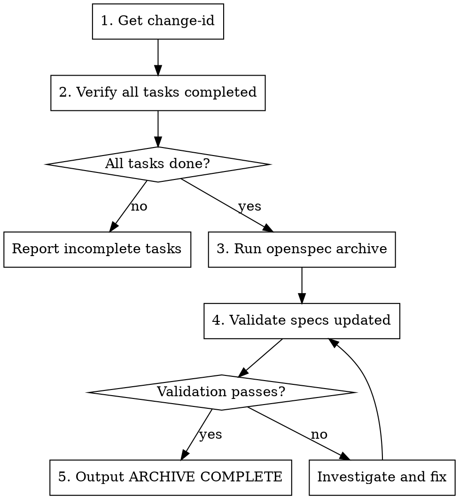

# Done Phase

Archive completed change and update specs.

**Arguments:** `$ARGUMENTS` (change-id)

## Process



## Step 1: Get Change ID

The change-id should be provided as argument:
```
/agentic-dev:done add-shortcuts
```

If not provided, check active changes:
```bash
openspec list
```

## Step 2: Verify All Tasks Completed

Read `openspec/changes/<change-id>/tasks.md` and check:

```bash
# Count uncompleted tasks
grep -c '\- \[ \]' openspec/changes/<change-id>/tasks.md
```

If ANY `- [ ]` items remain:
- List the uncompleted tasks
- Ask user to complete them first OR
- In Ralph Loop mode, output error and stop

**Do NOT archive with incomplete tasks.**

## Step 3: Run Archive Command

```bash
openspec archive <change-id> --yes
```

Flags:
- `--yes`: Skip confirmation prompts (for automation)
- `--skip-specs`: Only for tooling-only changes (no spec updates needed)

Expected output:
- Change moved to `openspec/changes/archive/YYYY-MM-DD-<change-id>/`
- Specs updated in `openspec/specs/`

## Step 4: Validate

```bash
openspec validate --strict
```

Check that:
1. Archive directory exists with correct date prefix
2. Specs were updated (check `openspec/specs/<capability>/spec.md`)
3. No validation errors

If validation fails:
```bash
openspec show <change-id> --json
openspec list --specs
```

## Step 5: Update Documentation

Update project documentation to reflect completed change:

### README.md
- Remove entry from "Active Changes" table (now archived)
- Add new features/tools to main documentation sections
- Update Quick Start if new commands available
- Update Architecture diagram if structure changed

### CLAUDE.md
- Finalize any command documentation
- Update workflow instructions if affected
- Ensure all new capabilities are documented

## Step 6: Complete

When archive, validation, and docs are updated:

```
<promise>ARCHIVE COMPLETE</promise>
```

## Post-Archive Summary

Output a summary:

```markdown
## Archive Complete

**Change:** add-shortcuts
**Archived to:** openspec/changes/archive/2024-01-16-add-shortcuts/
**Specs updated:**
- openspec/specs/shortcuts/spec.md (new)
- openspec/specs/settings/spec.md (modified)

All validation checks passed.
```

## Red Flags

- Archiving with incomplete tasks
- Skipping validation
- Not checking specs were actually updated
- Archiving wrong change-id

## Troubleshooting

### Archive command fails
```bash
# Check change exists and is not already archived
openspec list
openspec show <change-id>
```

### Specs not updated
```bash
# Check deltas were correct
openspec show <change-id> --json --deltas-only

# Manually inspect specs
ls openspec/specs/
cat openspec/specs/<capability>/spec.md
```

### Validation errors after archive
```bash
# Full validation output
openspec validate --strict

# Check specific spec
openspec show <spec-id> --type spec --json
```
