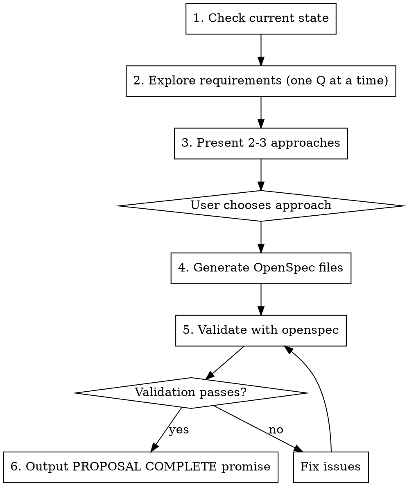

# Proposal Phase

Create OpenSpec change proposal through collaborative exploration.

## Process



## Step 1: Check Current State

Before exploring, understand the codebase:

```bash
openspec list              # Active changes
openspec list --specs      # Existing capabilities
```

Check for conflicts or related work.

## Step 2: Explore Requirements

**One question at a time.** Prefer multiple choice when possible.

Example questions:
- "What's the primary use case for this feature?"
- "Should this be user-configurable?"
- "Which existing components does this interact with?"
- "What's the expected error behavior?"

**Stop exploring when you have enough to propose approaches.**

## Step 3: Present Approaches

Present 2-3 approaches with trade-offs:

```markdown
I've identified 3 possible approaches:

**A) [Name] (Recommended)**
- Pros: ...
- Cons: ...
- Effort: Low/Medium/High

**B) [Name]**
- Pros: ...
- Cons: ...
- Effort: ...

**C) [Name]**
- Pros: ...
- Cons: ...
- Effort: ...

I recommend A because [reason]. Which approach would you prefer?
```

## Step 4: Generate OpenSpec Files

Create files under `openspec/changes/<change-id>/`:

### 4.1 Choose change-id
- Kebab-case, verb-led: `add-shortcuts`, `update-auth-flow`, `remove-legacy-api`
- Must be unique (check with `openspec list`)

### 4.2 Create proposal.md

```markdown
# Change: [Brief description]

## Why
[1-2 sentences on problem/opportunity]

## What Changes
- [Bullet list of changes]
- [Mark breaking changes with **BREAKING**]

## Impact
- Affected specs: [list capabilities]
- Affected code: [key files/systems]
```

### 4.3 Create design.md (if needed)

Create only if:
- Cross-cutting change (multiple services/modules)
- New external dependency
- Security/performance implications
- Architectural decisions needed

```markdown
## Context
[Background, constraints]

## Goals / Non-Goals
- Goals: [...]
- Non-Goals: [...]

## Decisions
- Decision: [What and why]
- Alternatives: [Options considered]

## Risks / Trade-offs
- [Risk] -> Mitigation
```

### 4.4 Create tasks.md

Use TDD-style format for Ralph Loop compatibility:

```markdown
## 1. Implementation

### Task 1.1: [Component Name]

**Files:**
- Create: `exact/path/to/file.ts`
- Modify: `exact/path/to/existing.ts:123-145`
- Test: `tests/path/to/test.ts`

**Steps:**
- [ ] 1.1.1 Write failing test
- [ ] 1.1.2 Run test, verify failure
- [ ] 1.1.3 Implement minimal code
- [ ] 1.1.4 Run test, verify pass
- [ ] 1.1.5 Commit

### Task 1.2: [Next Component]
...
```

### 4.5 Create spec deltas

Under `openspec/changes/<id>/specs/<capability>/spec.md`:

```markdown
## ADDED Requirements

### Requirement: [Name]
The system SHALL [behavior].

#### Scenario: [Success case]
- **WHEN** [condition]
- **THEN** [expected result]

## MODIFIED Requirements
[Full updated requirement text - not partial]

## REMOVED Requirements
### Requirement: [Name]
**Reason**: [Why removing]
**Migration**: [How to handle]
```

## Step 5: Validate

```bash
openspec validate <change-id> --strict
```

If validation fails:
- Check scenario format: must be `#### Scenario:` (4 hashtags)
- Check requirement has at least one scenario
- Check delta operations: `## ADDED|MODIFIED|REMOVED Requirements`

Debug with:
```bash
openspec show <change-id> --json --deltas-only
```

## Step 6: Update Documentation

Update project documentation to reflect the new proposal:

### README.md
- Add entry to "Active Changes" table with change-id, description, status "Proposed"
- Update any affected architecture/feature sections if relevant

### CLAUDE.md
- No changes typically needed for proposal phase
- Only update if the change affects development workflow

## Step 7: Complete

When validation passes and docs are updated:

```
<promise>PROPOSAL COMPLETE</promise>
```

## Red Flags

- Writing code during proposal phase (don't!)
- Skipping validation
- Creating spec deltas without scenarios
- Using MODIFIED without full requirement text
- Proposing without exploring requirements first
